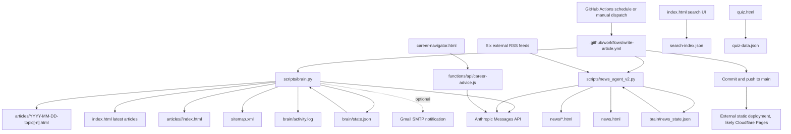

# ITVedas Repository Knowledge Map

**Repository:** `itvedas29/itvedas`  
**Branch scanned:** `main`  
**Audit date:** 2026-06-18  
**Scope:** Full recursive snapshot of the repository (82 files)

## Executive summary

ITVedas is a static content site with two autonomous Python content agents, one Cloudflare Pages API function, and two GitHub Actions workflows.

The autopilot has two independent lanes:

1. **Evergreen article lane** - `scripts/brain.py` selects the next keyword from an embedded calendar, asks Anthropic Claude to write and review an article, renders HTML, updates navigation surfaces, persists state, and optionally emails a notification.
2. **News lane** - `scripts/news_agent_v2.py` reads six RSS feeds, classifies and deduplicates headlines, asks Claude for original commentary, writes up to four news pages, persists a rolling 40-story state file, and rebuilds `news.html`.

Both lanes are scheduled and published by `.github/workflows/write-article.yml`. The workflow commits generated files directly to `main` using `GITHUB_TOKEN`. The repository itself has no build system, package manifest, or deployment configuration. Static hosting/deployment is therefore controlled outside this repository. The presence of `functions/api/career-advice.js` establishes Cloudflare Pages Functions as the intended server runtime.

The primary control file for article generation is `scripts/brain.py`. Its embedded `CALENDAR`, prompts, chapter taxonomy, templates, state update rules, and publishing functions collectively form the article "brain."

## Repository inventory

| Area | Files | Purpose |
|---|---:|---|
| Root static pages | 10 HTML/JSON/XML files | Homepage, about, career tools, quiz, news index, search index, sitemap |
| Evergreen articles | 13 HTML files | Five autopilot articles plus eight manually added complete guides |
| Chapter indexes | 8 HTML files | Category landing pages under `articles/<chapter>/index.html` |
| News pages | 36 HTML files | Generated news commentary |
| News images | 4 JPG files | Images referenced by some news state records |
| Drafts | 1 HTML file | Unpublished article draft |
| Brain state | 3 files | Article state, news state, activity log |
| Automation scripts | 2 Python files | Evergreen and news content agents |
| API functions | 1 JavaScript file | Career recommendation endpoint |
| GitHub workflows | 2 YAML files | Autopilot publishing and static validation |
| Documentation/config | 2 files | `README.md`, `.gitignore` |

Extension totals at the audited revision: 66 HTML, 4 JSON, 4 JPG, 2 Python, 2 YAML, 1 JavaScript, 1 XML, 1 Markdown, 1 log, and 1 gitignore file.

## System map



## Workflow catalog

### 1. ITVedas Autopilot

**Controller:** `.github/workflows/write-article.yml`  
**Permissions:** `contents: write`  
**Runner:** Ubuntu, Python 3.12  
**Concurrency group:** `itvedas-autopilot`, queued rather than cancelled

Scheduled triggers, expressed in IST by the workflow comments:

| Trigger | UTC cron | Action |
|---|---|---|
| Mon/Wed/Fri 09:00 IST | `30 3 * * 1,3,5` | Run evergreen article brain |
| Daily 08:00 IST | `30 2 * * *` | Run news agent |
| Daily 13:00 IST | `30 7 * * *` | Run news agent |
| Daily 18:00 IST | `30 12 * * *` | Run news agent |

Manual dispatch accepts `both`, `article_only`, or `news_only`.

Publishing sequence:

1. Checkout full history using `GITHUB_TOKEN`.
2. Set up Python 3.12.
3. Conditionally run one or both agents.
4. Configure the `ITVedas Bot <bot@itvedas.com>` Git identity.
5. Stage all changes.
6. Pull/rebase/autostash from `origin/main`.
7. Commit only when staged changes exist.
8. Push directly to `main`.

Required secret: `ANTHROPIC_API_KEY`.

Optional article secrets: `GA4_ID`, `NOTIFY_EMAIL`, `SMTP_FROM`, and `SMTP_PASS`.

### 2. Static-site validation

**Controller:** `.github/workflows/validate-static-site.yml`  
**Triggers:** Every push to `main`, plus manual dispatch  
**Permission:** `contents: read`

Checks currently performed:

- Parse `search-index.json` as JSON.
- Confirm the repaired security article has no leaked code fence.
- Confirm that article has a conclusion heading.
- Confirm placeholder EmailJS configuration is absent from `quiz.html`.
- Confirm `index.html` fetches `/search-index.json`.

This workflow validates after content has already been pushed. It does not gate the autopilot commit, validate every generated HTML file, verify links, verify the sitemap, or execute either Python agent in a dry-run mode.

## Evergreen article brain

**Primary controller:** `scripts/brain.py`  
**State:** `brain/state.json`  
**Audit trail:** `brain/activity.log`

### Embedded policy and configuration

The following are code, not external configuration:

- Anthropic model: `claude-haiku-4-5-20251001`
- Site URL/name/contact
- Eight-chapter taxonomy and display metadata
- Topic-to-chapter aliases
- 39-keyword, 13-week content calendar
- Writing prompt and style rules
- Review prompt and score threshold
- Article HTML/CSS/JSON-LD template
- Chapter index template
- Homepage latest-articles markup
- Sitemap composition
- SMTP notification template

Changing article strategy therefore requires editing `scripts/brain.py`; there is no separate calendar, prompt, or template file.

### Function map

| Function | Responsibility |
|---|---|
| `color_for` | Resolves a topic to its chapter color |
| `log` | Prints and appends timestamped events to `brain/activity.log` |
| `claude` | Calls Anthropic Messages API with three attempts and fixed retry delay |
| `load_state` / `save_state` | Reads state and atomically replaces `brain/state.json` |
| `ga4_snippet` | Emits analytics markup when `GA4_ID` exists |
| `reading_time` | Estimates reading time at 200 words/minute |
| `slugify` | Creates lowercase hyphenated anchors/slugs |
| `pick_keyword` | Selects the first unused calendar item; resets after exhaustion |
| `write_article` | Prompts Claude for 1,500-2,000 words plus a META block |
| `review` | Prompts Claude to score the first 2,000 characters |
| `extract_meta` | Parses the META comment and H1 with fallbacks |
| `build_page` | Produces the complete article page, TOC, SEO, JSON-LD, and style |
| `update_homepage` | Replaces/inserts the latest eight state-backed articles |
| `build_chapter_pages` | Rebuilds all eight chapter indexes from article state |
| `build_sitemap` | Rewrites the sitemap from fixed pages, chapters, and article state |
| `send_email` | Optionally sends a Gmail SMTP publication notice |
| `main` | Orchestrates the entire article transaction |

### Execution flow

1. Exit if `ANTHROPIC_API_KEY` is missing.
2. Load `brain/state.json` or initialize empty state.
3. Choose the first calendar keyword absent from `used_keywords`.
4. Ask Claude for an article and metadata comment.
5. Ask Claude to review the first 2,000 characters.
6. If verdict is `REWRITE`, regenerate once; the rewrite is not reviewed again.
7. Parse title, description, keyword, and topic.
8. Render the full page.
9. Write `articles/YYYY-MM-DD-topic.html`; add `-1`, `-2`, etc. on collision.
10. Append state, capped to the latest 60 published records and 60 keywords.
11. Rebuild homepage latest articles.
12. Rebuild every chapter landing page.
13. Rewrite `sitemap.xml`.
14. Atomically save state.
15. Optionally send email.
16. The workflow commits and pushes all resulting changes.

### Current state

`brain/state.json` records five autopilot articles:

- 2 Networking
- 1 Cloud
- 1 Security
- 1 DevOps

The next calendar item is the SQL-vs-NoSQL database article. The last recorded brain run was 2026-06-17 14:40 local runner time.

## News generation brain

**Controller:** `scripts/news_agent_v2.py`  
**State:** `brain/news_state.json`

### Inputs

The agent reads up to five title candidates from each of six feeds:

- The Hacker News
- BleepingComputer
- SecurityWeek
- AWS News Blog
- Kubernetes
- Microsoft Cloud Blog

### Function map

| Function | Responsibility |
|---|---|
| `think` | Calls Anthropic Messages API with retry |
| `fetch_feed` | Downloads and regex-parses RSS/XML |
| `classify` | Assigns one of ten topics using title keywords |
| `write_original_article` | Prompts Claude for 500-700 words of commentary |
| `parse_article` | Extracts META fields and article body |
| `build_article_page` | Renders a standalone news page and source citation |
| `build_news_index` | Rebuilds `news.html` with topic filters |
| `slugify` | Produces a maximum 60-character slug |
| `main` | Runs feed ingestion, generation, state, and index publication |

### Execution flow

1. Exit if `ANTHROPIC_API_KEY` is missing.
2. Read `brain/news_state.json`.
3. Fetch all six feeds sequentially.
4. Deduplicate using the lowercase first 50 characters of the original title.
5. Generate at most four fresh stories per run.
6. Classify each title with keyword rules.
7. Ask Claude for a new headline, summary, and body.
8. Render `news/YYYY-MM-DD-slug.html`.
9. Prepend the record to state.
10. Keep only 40 state records.
11. Atomically replace `brain/news_state.json`.
12. Atomically replace `news.html`.
13. The workflow commits and pushes the changes.

The news agent does not update `sitemap.xml`, homepage news cards, or `search-index.json`.

## API catalog

### POST /api/career-advice

**Implementation:** `functions/api/career-advice.js`  
**Runtime:** Cloudflare Pages Functions  
**Caller:** `career-navigator.html`

Request shape:

```json
{
  "answers": [
    { "question": "Question text", "answer": "Visitor answer" }
  ]
}
```

Behavior:

1. Allows ITVedas production origins and localhost; requests without an `Origin` header are accepted.
2. Parses JSON.
3. Requires a non-empty answers array.
4. Caps the aggregate question/answer character count at 6,000.
5. Reads `ANTHROPIC_API_KEY` from Cloudflare environment variables.
6. Prompts Claude to select exactly one of eight chapter keys.
7. Parses JSON and falls back to `networking` for an invalid chapter.
8. Truncates explanation and next-step output.
9. Returns JSON to the browser.

Response shape:

```json
{
  "chapter": "security",
  "chapter_label": "Cybersecurity",
  "explanation": "Why the path fits",
  "next_steps": ["Step one", "Step two", "Step three"]
}
```

### GET /api/career-advice

Returns HTTP 405 with `{"error":"Use POST"}`.

### Frontend logic using local data

- `index.html` fetches `search-index.json` for client-side article search.
- `quiz.html` fetches `quiz-data.json`, shuffles questions/options, scores by topic, and recommends weak-topic chapter links.
- `career-navigator.html` holds answers in memory only, posts them to the career API, renders escaped output, and emits a GA4 completion event when analytics is available.
- `index.html` also contains client-side subnet and DNS demonstrations. The DNS demo is simulated and does not call an external resolver.

## File ownership map

### Files controlled by the evergreen brain

- `articles/YYYY-MM-DD-topic[-n].html`
- `articles/networking/index.html`
- `articles/cloud/index.html`
- `articles/security/index.html`
- `articles/devops/index.html`
- `articles/databases/index.html`
- `articles/linux/index.html`
- `articles/hardware/index.html`
- `articles/compliance/index.html`
- The `LATEST_ARTICLES` marker region in `index.html`
- `sitemap.xml`
- `brain/state.json`
- `brain/activity.log`

### Files controlled by the news agent

- `news/*.html`
- `news.html`
- `brain/news_state.json`

### Manually maintained or separately generated

- Eight `articles/2026-06-17-complete-*-guide.html` guides
- `search-index.json`
- `about.html`
- `career-paths.html`
- `career-navigator.html`
- `quiz.html`
- `quiz-data.json`
- `functions/api/career-advice.js`
- `drafts/articles/2026-06-16-security.html`
- Existing `news/images/*.jpg`
- GitHub workflow and documentation files

## Publishing architecture

The repository publishes by committing finished static assets, not by building an application artifact.

**Content publication:** GitHub Actions writes files and pushes them to `main`.

**Site deployment:** No GitHub Pages workflow, Cloudflare configuration file, Wrangler file, package manifest, or deployment script exists in the repository. Deployment is therefore configured in an external hosting dashboard. Because the repo contains a Cloudflare Pages Function under `functions/api/`, Cloudflare Pages is the intended and likely host, but that cannot be proven solely from repository files.

**API deployment:** Cloudflare Pages automatically maps `functions/api/career-advice.js` to `/api/career-advice` when the repository is deployed as a Pages project.

## Important findings

### Critical: state can erase manually published navigation

The eight complete guides exist in `articles/` but are absent from `brain/state.json`. Every evergreen run rebuilds all chapter indexes and `sitemap.xml` exclusively from state. The next run can therefore remove those guides from chapter navigation and the sitemap even though the files remain present.

**Control point:** `scripts/brain.py` functions `build_chapter_pages` and `build_sitemap`.

### High: generated articles are not added to search

The homepage search reads `search-index.json`, but neither content agent updates that file. New autopilot articles and news pages remain undiscoverable through site search unless the index is edited separately.

### High: RSS parsing has demonstrated source/headline mismatches

`fetch_feed` extracts titles, links, and descriptions with separate regex passes and matches them by list position. RSS and Atom structures vary, so these arrays can drift. Current `brain/news_state.json` contains clear mismatches between `orig_title` and generated story subject. This creates factual and source-attribution risk.

### High: autopilot publishes directly without pre-publication validation

Generated content is pushed directly to `main`. Validation runs only after the push and covers a few fixed assertions. There is no HTML parser, link checker, schema validation, sitemap reconciliation, prompt-output sanitizer, or pull-request review gate.

### Medium: self-review is shallow

The reviewer sees only the first 2,000 characters. A rewrite does not receive the review feedback and is assigned score 80 without a second review. The quality score is therefore not a dependable publication gate.

### Medium: model output is interpolated as trusted HTML

Article/news bodies, titles, summaries, metadata, and source values are inserted into HTML and JSON-LD without structured escaping or sanitization. Malformed model output can break pages; feed-controlled values increase the trust boundary.

### Medium: career API is cost-abuse prone

The endpoint has an origin allowlist and payload cap, but no rate limit, bot control, session token, or per-IP quota. Requests with no `Origin` are accepted. An attacker can call the public function directly and consume Anthropic API budget.

### Medium: news content is absent from sitemap automation

The news agent rebuilds `news.html` but does not add individual stories to `sitemap.xml`. Search engine discovery depends on crawling the news index.

### Low: no explicit dependency lock or test harness

The Python agents use only the standard library, so no Python package install is currently required. However, there are no unit tests, fixtures, dry-run mode, or deterministic feed/parser tests. The Cloudflare function also has no local test configuration.

## Recommended control-file split

To make the autopilot safer and easier to operate, split `scripts/brain.py` into declarative controls and implementation:

| Proposed file | Responsibility |
|---|---|
| `config/chapters.json` | Chapter taxonomy, aliases, colors, labels |
| `config/content-calendar.json` | Ordered evergreen keyword calendar |
| `prompts/article.md` | Article generation instructions |
| `prompts/article-review.md` | Quality rubric |
| `templates/article.html` | Evergreen page template |
| `templates/chapter.html` | Chapter index template |
| `scripts/rebuild_catalog.py` | Discover all article files and rebuild search, chapters, and sitemap |
| `scripts/validate_content.py` | Parse HTML/JSON-LD, check required metadata and internal links |
| `tests/fixtures/feeds/` | RSS and Atom parser fixtures |

The highest-value immediate change is to make catalog generation discover files from disk or a canonical manifest rather than treating `brain/state.json` as the complete catalog.

## Operational runbook

### Generate an evergreen article manually

Actions -> **ITVedas Autopilot** -> **Run workflow** -> `article_only`.

Expected modified files: one article, article state, activity log, homepage latest section, all eight chapter indexes, and sitemap.

### Generate news manually

Actions -> **ITVedas Autopilot** -> **Run workflow** -> `news_only`.

Expected modified files: up to four news pages, news state, and `news.html`.

### Investigate article failures

1. Inspect the failed **ITVedas Autopilot** workflow.
2. Check whether `ANTHROPIC_API_KEY` is configured.
3. Read the tail of `brain/activity.log`.
4. Confirm `brain/state.json` parses and its last keyword was not advanced unexpectedly.
5. Verify generated HTML before rerunning.

### Investigate career API failures

1. Confirm the site is deployed on Cloudflare Pages with Functions enabled.
2. Confirm `ANTHROPIC_API_KEY` exists in the correct Pages environment.
3. Check the Pages Function logs for Claude status/parse errors.
4. POST a small valid answers array to `/api/career-advice`.
5. Confirm the production domain matches the origin allowlist.

## Bottom line

The current autopilot is compact and functional: GitHub Actions schedules two standard-library Python agents, Claude supplies prose and recommendations, JSON files provide persistent memory, and generated static files are committed directly to production. Its simplicity is also its main constraint. State is being used as both memory and catalog, generated output is trusted too early, and publication surfaces are rebuilt inconsistently across content types.

For article generation, start with `scripts/brain.py`, then inspect `brain/state.json`, `.github/workflows/write-article.yml`, and the generated catalog surfaces (`index.html`, chapter indexes, `search-index.json`, and `sitemap.xml`). Those files collectively control what gets written, when it runs, and whether readers can discover it.
